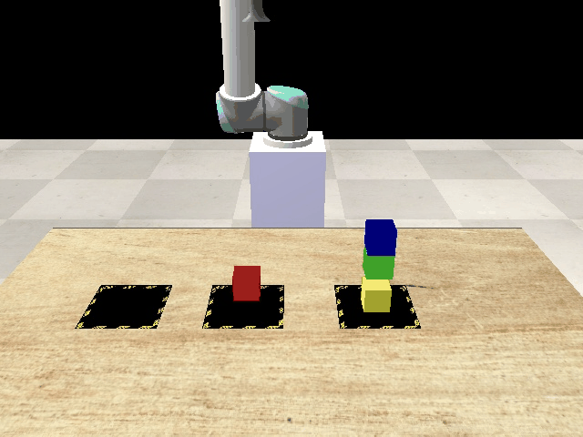
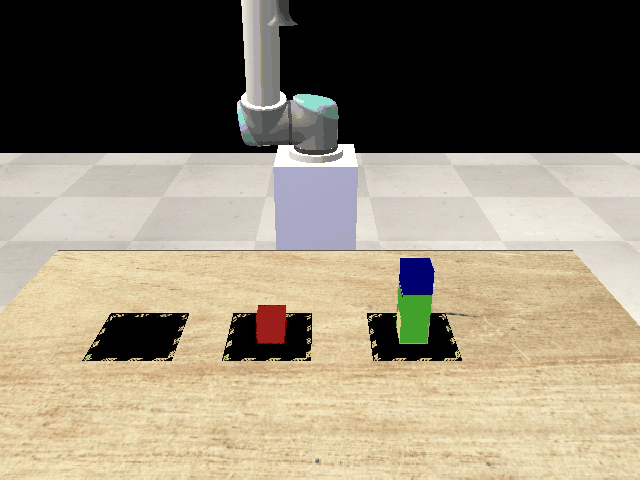
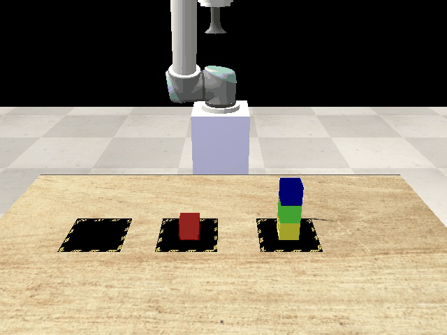
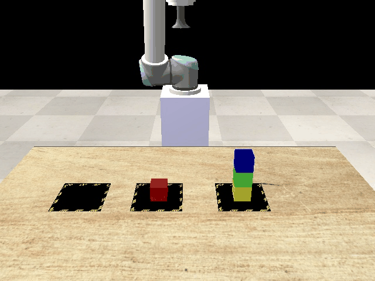

## Scenario 1
### Expirement 1

**Commands**
* {'action': 1, 'function': 'grasp', 'object': 'yellow_cube'}
* {'action': 2, 'function': 'go_home', 'object': ''}
* {'action': 3, 'function': 'place', 'object': 'red_cube'}
* {'action': 4, 'function': 'go_home', 'object': ''}
### Expirement 2

**Commands**
* {'action': 1, 'function': 'grasp', 'object': 'yellow_cube'}
* {'action': 2, 'function': 'go_home', 'object': ''}
* {'action': 3, 'function': 'place', 'object': 'red_cube'}
* {'action': 4, 'function': 'go_home', 'object': ''}
### Expirement 3

**Commands**
* {'action': 1, 'function': 'grasp', 'object': 'yellow_cube'}
* {'action': 2, 'function': 'go_home', 'object': ''}
* {'action': 3, 'function': 'place', 'object': 'red_cube'}
* {'action': 4, 'function': 'go_home', 'object': ''}
### Expirement 4

**Commands**
* {'action': 1, 'function': 'grasp', 'object': 'green_cube'}
* {'action': 2, 'function': 'go_home', 'object': ''}
* {'action': 3, 'function': 'place', 'object': 'pad_three'}
* {'action': 4, 'function': 'go_home', 'object': ''}
* {'action': 5, 'function': 'grasp', 'object': 'yellow_cube'}
* {'action': 6, 'function': 'go_home', 'object': ''}
* {'action': 7, 'function': 'place', 'object': 'red_cube'}
* {'action': 8, 'function': 'go_home', 'object': ''}
* {'action': 9, 'function': 'grasp', 'object': 'green_cube'}
* {'action': 10, 'function': 'go_home', 'object': ''}
* {'action': 11, 'function': 'place', 'object': 'yellow_cube'}
* {'action': 12, 'function': 'go_home', 'object': ''}
### Expirement 5

**Commands**
* {'action': 1, 'function': 'grasp', 'object': 'yellow_cube'}
* {'action': 2, 'function': 'go_home', 'object': ''}
* {'action': 3, 'function': 'place', 'object': 'red_cube'}
* {'action': 4, 'function': 'go_home', 'object': ''}
### Expirement 6

**Commands**
* {'action': 1, 'function': 'grasp', 'object': 'green_cube'}
* {'action': 2, 'function': 'go_home', 'object': ''}
* {'action': 3, 'function': 'place', 'object': 'table_surface'}
* {'action': 4, 'function': 'go_home', 'object': ''}
* {'action': 5, 'function': 'grasp', 'object': 'yellow_cube'}
* {'action': 6, 'function': 'go_home', 'object': ''}
* {'action': 7, 'function': 'place', 'object': 'red_cube'}
* {'action': 8, 'function': 'go_home', 'object': ''}
* {'action': 9, 'function': 'grasp', 'object': 'green_cube'}
* {'action': 10, 'function': 'go_home', 'object': ''}
* {'action': 11, 'function': 'place', 'object': 'yellow_cube'}
* {'action': 12, 'function': 'go_home', 'object': ''}
### Expirement 7

**Commands**
* {'action': 1, 'function': 'grasp', 'object': 'yellow_cube'}
* {'action': 2, 'function': 'go_home', 'object': ''}
* {'action': 3, 'function': 'place', 'object': 'red_cube'}
* {'action': 4, 'function': 'go_home', 'object': ''}
### Expirement 8

**Commands**
* {'action': 1, 'function': 'grasp', 'object': 'yellow_cube'}
* {'action': 2, 'function': 'go_home', 'object': ''}
* {'action': 3, 'function': 'place', 'object': 'red_cube'}
* {'action': 4, 'function': 'go_home', 'object': ''}
### Expirement 9

**Commands**
* {'action': 1, 'function': 'grasp', 'object': 'yellow_cube'}
* {'action': 2, 'function': 'go_home', 'object': ''}
* {'action': 3, 'function': 'place', 'object': 'red_cube'}
* {'action': 4, 'function': 'go_home', 'object': ''}
### Expirement 10

**Commands**
* {'action': 1, 'function': 'grasp', 'object': 'yellow_cube'}
* {'action': 2, 'function': 'go_home', 'object': ''}
* {'action': 3, 'function': 'place', 'object': 'red_cube'}
* {'action': 4, 'function': 'go_home', 'object': ''}
## Scenario 2
### Expirement 1

**Commands**
* {'action': 1, 'function': 'grasp', 'object': 'blue_cube'}
* {'action': 2, 'function': 'go_home', 'object': ''}
* {'action': 3, 'function': 'place', 'object': 'pad_three'}
* {'action': 4, 'function': 'go_home', 'object': ''}
* {'action': 5, 'function': 'grasp', 'object': 'green_cube'}
* {'action': 6, 'function': 'go_home', 'object': ''}
* {'action': 7, 'function': 'place', 'object': 'blue_cube'}
* {'action': 8, 'function': 'go_home', 'object': ''}
* {'action': 9, 'function': 'grasp', 'object': 'yellow_cube'}
* {'action': 10, 'function': 'go_home', 'object': ''}
* {'action': 11, 'function': 'place', 'object': 'green_cube'}
* {'action': 12, 'function': 'go_home', 'object': ''}
* {'action': 13, 'function': 'grasp', 'object': 'red_cube'}
* {'action': 14, 'function': 'go_home', 'object': ''}
* {'action': 15, 'function': 'place', 'object': 'blue_cube'}
* {'action': 16, 'function': 'go_home', 'object': ''}
### Expirement 2

**Commands**
* {'action': 1, 'function': 'grasp', 'object': 'blue_cube'}
* {'action': 2, 'function': 'go_home', 'object': ''}
* {'action': 3, 'function': 'place', 'object': 'pad_three'}
* {'action': 4, 'function': 'go_home', 'object': ''}
* {'action': 5, 'function': 'grasp', 'object': 'green_cube'}
* {'action': 6, 'function': 'go_home', 'object': ''}
* {'action': 7, 'function': 'place', 'object': 'blue_cube'}
* {'action': 8, 'function': 'go_home', 'object': ''}
* {'action': 9, 'function': 'grasp', 'object': 'yellow_cube'}
* {'action': 10, 'function': 'go_home', 'object': ''}
* {'action': 11, 'function': 'place', 'object': 'green_cube'}
* {'action': 12, 'function': 'go_home', 'object': ''}
* {'action': 13, 'function': 'grasp', 'object': 'red_cube'}
* {'action': 14, 'function': 'go_home', 'object': ''}
* {'action': 15, 'function': 'place', 'object': 'blue_cube'}
* {'action': 16, 'function': 'go_home', 'object': ''}
### Expirement 3

**Commands**
* {'action': 1, 'function': 'grasp', 'object': 'blue_cube'}
* {'action': 2, 'function': 'go_home'}
* {'action': 3, 'function': 'grasp', 'object': 'green_cube'}
* {'action': 4, 'function': 'go_home'}
* {'action': 5, 'function': 'place', 'object': 'pad_three'}
* {'action': 6, 'function': 'go_home'}
* {'action': 7, 'function': 'grasp', 'object': 'yellow_cube'}
* {'action': 8, 'function': 'go_home'}
* {'action': 9, 'function': 'place', 'object': 'green_cube'}
* {'action': 10, 'function': 'go_home'}
* {'action': 11, 'function': 'grasp', 'object': 'red_cube'}
* {'action': 12, 'function': 'go_home'}
* {'action': 13, 'function': 'place', 'object': 'blue_cube'}
* {'action': 14, 'function': 'go_home'}
* {'action': 15, 'function': 'place', 'object': 'yellow_cube'}
* {'action': 16, 'function': 'go_home'}
* {'action': 17, 'function': 'go_home'}
### Expirement 4

**Commands**
* {'action': 1, 'function': 'grasp', 'object': 'blue_cube'}
* {'action': 2, 'function': 'go_home'}
* {'action': 3, 'function': 'grasp', 'object': 'green_cube'}
* {'action': 4, 'function': 'go_home'}
* {'action': 5, 'function': 'place', 'object': 'pad_three'}
* {'action': 6, 'function': 'go_home'}
* {'action': 7, 'function': 'grasp', 'object': 'yellow_cube'}
* {'action': 8, 'function': 'go_home'}
* {'action': 9, 'function': 'place', 'object': 'green_cube'}
* {'action': 10, 'function': 'go_home'}
* {'action': 11, 'function': 'grasp', 'object': 'blue_cube'}
* {'action': 12, 'function': 'go_home'}
* {'action': 13, 'function': 'place', 'object': 'pad_three'}
* {'action': 14, 'function': 'go_home'}
* {'action': 15, 'function': 'grasp', 'object': 'red_cube'}
* {'action': 16, 'function': 'go_home'}
* {'action': 17, 'function': 'place', 'object': 'blue_cube'}
* {'action': 18, 'function': 'go_home'}
* {'action': 19, 'function': 'grasp', 'object': 'green_cube'}
* {'action': 20, 'function': 'go_home'}
* {'action': 21, 'function': 'place', 'object': 'blue_cube'}
* {'action': 22, 'function': 'go_home'}
* {'action': 23, 'function': 'grasp', 'object': 'yellow_cube'}
* {'action': 24, 'function': 'go_home'}
* {'action': 25, 'function': 'place', 'object': 'green_cube'}
* {'action': 26, 'function': 'go_home'}
### Expirement 5

**Commands**
* {'action': 1, 'function': 'grasp', 'object': 'blue_cube'}
* {'action': 2, 'function': 'go_home', 'object': ''}
* {'action': 3, 'function': 'place', 'object': 'pad_three'}
* {'action': 4, 'function': 'go_home', 'object': ''}
* {'action': 5, 'function': 'grasp', 'object': 'green_cube'}
* {'action': 6, 'function': 'go_home', 'object': ''}
* {'action': 7, 'function': 'place', 'object': 'blue_cube'}
* {'action': 8, 'function': 'go_home', 'object': ''}
* {'action': 9, 'function': 'grasp', 'object': 'yellow_cube'}
* {'action': 10, 'function': 'go_home', 'object': ''}
* {'action': 11, 'function': 'place', 'object': 'green_cube'}
* {'action': 12, 'function': 'go_home', 'object': ''}
* {'action': 13, 'function': 'grasp', 'object': 'red_cube'}
* {'action': 14, 'function': 'go_home', 'object': ''}
* {'action': 15, 'function': 'place', 'object': 'blue_cube'}
* {'action': 16, 'function': 'go_home', 'object': ''}
### Expirement 6

**Commands**
* {'action': 1, 'function': 'grasp', 'object': 'blue_cube'}
* {'action': 2, 'function': 'go_home', 'object': ''}
* {'action': 3, 'function': 'place', 'object': 'pad_three'}
* {'action': 4, 'function': 'go_home', 'object': ''}
* {'action': 5, 'function': 'grasp', 'object': 'green_cube'}
* {'action': 6, 'function': 'go_home', 'object': ''}
* {'action': 7, 'function': 'place', 'object': 'blue_cube'}
* {'action': 8, 'function': 'go_home', 'object': ''}
* {'action': 9, 'function': 'grasp', 'object': 'yellow_cube'}
* {'action': 10, 'function': 'go_home', 'object': ''}
* {'action': 11, 'function': 'place', 'object': 'green_cube'}
* {'action': 12, 'function': 'go_home', 'object': ''}
* {'action': 13, 'function': 'grasp', 'object': 'red_cube'}
* {'action': 14, 'function': 'go_home', 'object': ''}
* {'action': 15, 'function': 'place', 'object': 'blue_cube'}
* {'action': 16, 'function': 'go_home', 'object': ''}
### Expirement 7

**Commands**
* {'action': 1, 'function': 'grasp', 'object': 'blue_cube'}
* {'action': 2, 'function': 'go_home', 'object': ''}
* {'action': 3, 'function': 'grasp', 'object': 'green_cube'}
* {'action': 4, 'function': 'go_home', 'object': ''}
* {'action': 5, 'function': 'place', 'object': 'pad_three'}
* {'action': 6, 'function': 'go_home', 'object': ''}
* {'action': 7, 'function': 'place', 'object': 'blue_cube'}
* {'action': 8, 'function': 'go_home', 'object': ''}
* {'action': 9, 'function': 'grasp', 'object': 'yellow_cube'}
* {'action': 10, 'function': 'go_home', 'object': ''}
* {'action': 11, 'function': 'place', 'object': 'green_cube'}
* {'action': 12, 'function': 'go_home', 'object': ''}
* {'action': 13, 'function': 'grasp', 'object': 'red_cube'}
* {'action': 14, 'function': 'go_home', 'object': ''}
* {'action': 15, 'function': 'place', 'object': 'blue_cube'}
* {'action': 16, 'function': 'go_home', 'object': ''}
### Expirement 8

**Commands**
* {'action': 1, 'function': 'grasp', 'object': 'blue_cube'}
* {'action': 2, 'function': 'go_home', 'object': ''}
* {'action': 3, 'function': 'place', 'object': 'pad_three'}
* {'action': 4, 'function': 'go_home', 'object': ''}
* {'action': 5, 'function': 'grasp', 'object': 'green_cube'}
* {'action': 6, 'function': 'go_home', 'object': ''}
* {'action': 7, 'function': 'place', 'object': 'blue_cube'}
* {'action': 8, 'function': 'go_home', 'object': ''}
* {'action': 9, 'function': 'grasp', 'object': 'yellow_cube'}
* {'action': 10, 'function': 'go_home', 'object': ''}
* {'action': 11, 'function': 'place', 'object': 'green_cube'}
* {'action': 12, 'function': 'go_home', 'object': ''}
* {'action': 13, 'function': 'grasp', 'object': 'red_cube'}
* {'action': 14, 'function': 'go_home', 'object': ''}
* {'action': 15, 'function': 'place', 'object': 'blue_cube'}
* {'action': 16, 'function': 'go_home', 'object': ''}
### Expirement 9

**Commands**
* {'action': 1, 'function': 'grasp', 'object': 'blue_cube'}
* {'action': 2, 'function': 'go_home', 'object': ''}
* {'action': 3, 'function': 'place', 'object': 'pad_three'}
* {'action': 4, 'function': 'go_home', 'object': ''}
* {'action': 5, 'function': 'grasp', 'object': 'green_cube'}
* {'action': 6, 'function': 'go_home', 'object': ''}
* {'action': 7, 'function': 'place', 'object': 'blue_cube'}
* {'action': 8, 'function': 'go_home', 'object': ''}
* {'action': 9, 'function': 'grasp', 'object': 'yellow_cube'}
* {'action': 10, 'function': 'go_home', 'object': ''}
* {'action': 11, 'function': 'place', 'object': 'green_cube'}
* {'action': 12, 'function': 'go_home', 'object': ''}
* {'action': 13, 'function': 'grasp', 'object': 'red_cube'}
* {'action': 14, 'function': 'go_home', 'object': ''}
* {'action': 15, 'function': 'place', 'object': 'blue_cube'}
* {'action': 16, 'function': 'go_home', 'object': ''}
### Expirement 10

**Commands**
* {'action': 1, 'function': 'grasp', 'object': 'blue_cube'}
* {'action': 2, 'function': 'go_home', 'object': ''}
* {'action': 3, 'function': 'place', 'object': 'pad_three'}
* {'action': 4, 'function': 'go_home', 'object': ''}
* {'action': 5, 'function': 'grasp', 'object': 'green_cube'}
* {'action': 6, 'function': 'go_home', 'object': ''}
* {'action': 7, 'function': 'place', 'object': 'blue_cube'}
* {'action': 8, 'function': 'go_home', 'object': ''}
* {'action': 9, 'function': 'grasp', 'object': 'yellow_cube'}
* {'action': 10, 'function': 'go_home', 'object': ''}
* {'action': 11, 'function': 'place', 'object': 'green_cube'}
* {'action': 12, 'function': 'go_home', 'object': ''}
* {'action': 13, 'function': 'grasp', 'object': 'red_cube'}
* {'action': 14, 'function': 'go_home', 'object': ''}
* {'action': 15, 'function': 'place', 'object': 'blue_cube'}
* {'action': 16, 'function': 'go_home', 'object': ''}
## Scenario 3
### Expirement 1

**Commands**
* {'action': 1, 'function': 'grasp', 'object': 'blue_cube'}
* {'action': 2, 'function': 'go_home', 'object': ''}
* {'action': 3, 'function': 'place', 'object': 'pad_two'}
* {'action': 4, 'function': 'go_home', 'object': ''}
* {'action': 5, 'function': 'grasp', 'object': 'green_cube'}
* {'action': 6, 'function': 'go_home', 'object': ''}
* {'action': 7, 'function': 'place', 'object': 'pad_three'}
* {'action': 8, 'function': 'go_home', 'object': ''}
### Expirement 2

**Commands**
* {'action': 1, 'function': 'grasp', 'object': 'blue_cube'}
* {'action': 2, 'function': 'go_home', 'object': ''}
* {'action': 3, 'function': 'place', 'object': 'table_surface'}
* {'action': 4, 'function': 'go_home', 'object': ''}
* {'action': 5, 'function': 'grasp', 'object': 'green_cube'}
* {'action': 6, 'function': 'go_home', 'object': ''}
* {'action': 7, 'function': 'place', 'object': 'pad_three'}
* {'action': 8, 'function': 'go_home', 'object': ''}
### Expirement 3

**Commands**
* {'action': 1, 'function': 'grasp', 'object': 'blue_cube'}
* {'action': 2, 'function': 'go_home', 'object': ''}
* {'action': 3, 'function': 'place', 'object': 'pad_two'}
* {'action': 4, 'function': 'go_home', 'object': ''}
* {'action': 5, 'function': 'grasp', 'object': 'green_cube'}
* {'action': 6, 'function': 'go_home', 'object': ''}
* {'action': 7, 'function': 'place', 'object': 'pad_three'}
* {'action': 8, 'function': 'go_home', 'object': ''}
### Expirement 4

**Commands**
* {'action': 1, 'function': 'grasp', 'object': 'blue_cube'}
* {'action': 2, 'function': 'go_home', 'object': ''}
* {'action': 3, 'function': 'place', 'object': 'table_surface'}
* {'action': 4, 'function': 'go_home', 'object': ''}
* {'action': 5, 'function': 'grasp', 'object': 'green_cube'}
* {'action': 6, 'function': 'go_home', 'object': ''}
* {'action': 7, 'function': 'place', 'object': 'pad_three'}
* {'action': 8, 'function': 'go_home', 'object': ''}
### Expirement 5

**Commands**
* {'action': 1, 'function': 'grasp', 'object': 'blue_cube'}
* {'action': 2, 'function': 'go_home', 'object': ''}
* {'action': 3, 'function': 'place', 'object': 'table_surface'}
* {'action': 4, 'function': 'go_home', 'object': ''}
* {'action': 5, 'function': 'grasp', 'object': 'green_cube'}
* {'action': 6, 'function': 'go_home', 'object': ''}
* {'action': 7, 'function': 'place', 'object': 'pad_three'}
* {'action': 8, 'function': 'go_home', 'object': ''}
### Expirement 6

**Commands**
* {'action': 1, 'function': 'grasp', 'object': 'blue_cube'}
* {'action': 2, 'function': 'go_home', 'object': ''}
* {'action': 3, 'function': 'place', 'object': 'table_surface'}
* {'action': 4, 'function': 'go_home', 'object': ''}
* {'action': 5, 'function': 'grasp', 'object': 'green_cube'}
* {'action': 6, 'function': 'go_home', 'object': ''}
* {'action': 7, 'function': 'place', 'object': 'pad_three'}
* {'action': 8, 'function': 'go_home', 'object': ''}
### Expirement 7

**Commands**
* {'action': 1, 'function': 'grasp', 'object': 'blue_cube'}
* {'action': 2, 'function': 'go_home', 'object': ''}
* {'action': 3, 'function': 'place', 'object': 'table_surface'}
* {'action': 4, 'function': 'go_home', 'object': ''}
* {'action': 5, 'function': 'grasp', 'object': 'green_cube'}
* {'action': 6, 'function': 'go_home', 'object': ''}
* {'action': 7, 'function': 'place', 'object': 'pad_three'}
* {'action': 8, 'function': 'go_home', 'object': ''}
### Expirement 8

**Commands**
* {'action': 1, 'function': 'grasp', 'object': 'blue_cube'}
* {'action': 2, 'function': 'go_home', 'object': ''}
* {'action': 3, 'function': 'place', 'object': 'table_surface'}
* {'action': 4, 'function': 'go_home', 'object': ''}
* {'action': 5, 'function': 'grasp', 'object': 'green_cube'}
* {'action': 6, 'function': 'go_home', 'object': ''}
* {'action': 7, 'function': 'place', 'object': 'pad_three'}
* {'action': 8, 'function': 'go_home', 'object': ''}
### Expirement 9

**Commands**
* {'action': 1, 'function': 'grasp', 'object': 'blue_cube'}
* {'action': 2, 'function': 'go_home', 'object': ''}
* {'action': 3, 'function': 'place', 'object': 'pad_two'}
* {'action': 4, 'function': 'go_home', 'object': ''}
* {'action': 5, 'function': 'grasp', 'object': 'green_cube'}
* {'action': 6, 'function': 'go_home', 'object': ''}
* {'action': 7, 'function': 'place', 'object': 'pad_three'}
* {'action': 8, 'function': 'go_home', 'object': ''}
* {'action': 9, 'function': 'grasp', 'object': 'blue_cube'}
* {'action': 10, 'function': 'go_home', 'object': ''}
* {'action': 11, 'function': 'place', 'object': 'green_cube'}
* {'action': 12, 'function': 'go_home', 'object': ''}
### Expirement 10

**Commands**
* {'action': 1, 'function': 'grasp', 'object': 'blue_cube'}
* {'action': 2, 'function': 'go_home', 'object': ''}
* {'action': 3, 'function': 'place', 'object': 'table_surface'}
* {'action': 4, 'function': 'go_home', 'object': ''}
* {'action': 5, 'function': 'grasp', 'object': 'green_cube'}
* {'action': 6, 'function': 'go_home', 'object': ''}
* {'action': 7, 'function': 'place', 'object': 'pad_three'}
* {'action': 8, 'function': 'go_home', 'object': ''}
## Scenario 4
### Expirement 1

**Commands**
* {'action': 1, 'function': 'grasp', 'object': 'blue_cube'}
* {'action': 2, 'function': 'go_home', 'object': ''}
* {'action': 3, 'function': 'place', 'object': 'table_surface'}
* {'action': 4, 'function': 'go_home', 'object': ''}
* {'action': 5, 'function': 'grasp', 'object': 'green_cube'}
* {'action': 6, 'function': 'go_home', 'object': ''}
* {'action': 7, 'function': 'place', 'object': 'table_surface'}
* {'action': 8, 'function': 'go_home', 'object': ''}
* {'action': 9, 'function': 'grasp', 'object': 'yellow_cube'}
* {'action': 10, 'function': 'go_home', 'object': ''}
* {'action': 11, 'function': 'place', 'object': 'pad_three'}
* {'action': 12, 'function': 'go_home', 'object': ''}
### Expirement 2

**Commands**
* {'action': 1, 'function': 'grasp', 'object': 'blue_cube'}
* {'action': 2, 'function': 'go_home', 'object': ''}
* {'action': 3, 'function': 'place', 'object': 'table_surface'}
* {'action': 4, 'function': 'go_home', 'object': ''}
* {'action': 5, 'function': 'grasp', 'object': 'green_cube'}
* {'action': 6, 'function': 'go_home', 'object': ''}
* {'action': 7, 'function': 'place', 'object': 'table_surface'}
* {'action': 8, 'function': 'go_home', 'object': ''}
* {'action': 9, 'function': 'grasp', 'object': 'yellow_cube'}
* {'action': 10, 'function': 'go_home', 'object': ''}
* {'action': 11, 'function': 'place', 'object': 'pad_three'}
* {'action': 12, 'function': 'go_home', 'object': ''}
### Expirement 3

**Commands**
* {'action': 1, 'function': 'grasp', 'object': 'blue_cube'}
* {'action': 2, 'function': 'go_home', 'object': ''}
* {'action': 3, 'function': 'place', 'object': 'table_surface'}
* {'action': 4, 'function': 'go_home', 'object': ''}
* {'action': 5, 'function': 'grasp', 'object': 'green_cube'}
* {'action': 6, 'function': 'go_home', 'object': ''}
* {'action': 7, 'function': 'place', 'object': 'table_surface'}
* {'action': 8, 'function': 'go_home', 'object': ''}
* {'action': 9, 'function': 'grasp', 'object': 'yellow_cube'}
* {'action': 10, 'function': 'go_home', 'object': ''}
* {'action': 11, 'function': 'place', 'object': 'pad_three'}
* {'action': 12, 'function': 'go_home', 'object': ''}
### Expirement 4

**Commands**
* {'action': 1, 'function': 'grasp', 'object': 'blue_cube'}
* {'action': 2, 'function': 'go_home', 'object': ''}
* {'action': 3, 'function': 'place', 'object': 'table_surface'}
* {'action': 4, 'function': 'go_home', 'object': ''}
* {'action': 5, 'function': 'grasp', 'object': 'green_cube'}
* {'action': 6, 'function': 'go_home', 'object': ''}
* {'action': 7, 'function': 'place', 'object': 'table_surface'}
* {'action': 8, 'function': 'go_home', 'object': ''}
* {'action': 9, 'function': 'grasp', 'object': 'yellow_cube'}
* {'action': 10, 'function': 'go_home', 'object': ''}
* {'action': 11, 'function': 'place', 'object': 'pad_three'}
* {'action': 12, 'function': 'go_home', 'object': ''}
### Expirement 5

**Commands**
* {'action': 1, 'function': 'grasp', 'object': 'blue_cube'}
* {'action': 2, 'function': 'go_home', 'object': ''}
* {'action': 3, 'function': 'place', 'object': 'table_surface'}
* {'action': 4, 'function': 'go_home', 'object': ''}
* {'action': 5, 'function': 'grasp', 'object': 'green_cube'}
* {'action': 6, 'function': 'go_home', 'object': ''}
* {'action': 7, 'function': 'place', 'object': 'table_surface'}
* {'action': 8, 'function': 'go_home', 'object': ''}
* {'action': 9, 'function': 'grasp', 'object': 'yellow_cube'}
* {'action': 10, 'function': 'go_home', 'object': ''}
* {'action': 11, 'function': 'place', 'object': 'pad_three'}
* {'action': 12, 'function': 'go_home', 'object': ''}
### Expirement 6

**Commands**
* {'action': 1, 'function': 'grasp', 'object': 'blue_cube'}
* {'action': 2, 'function': 'go_home', 'object': ''}
* {'action': 3, 'function': 'grasp', 'object': 'green_cube'}
* {'action': 4, 'function': 'go_home', 'object': ''}
* {'action': 5, 'function': 'grasp', 'object': 'yellow_cube'}
* {'action': 6, 'function': 'go_home', 'object': ''}
* {'action': 7, 'function': 'place', 'object': 'pad_three'}
* {'action': 8, 'function': 'go_home', 'object': ''}
* {'action': 9, 'function': 'place', 'object': 'green_cube'}
* {'action': 10, 'function': 'go_home', 'object': ''}
* {'action': 11, 'function': 'place', 'object': 'blue_cube'}
* {'action': 12, 'function': 'go_home', 'object': ''}
### Expirement 7

**Commands**
* {'action': 1, 'function': 'grasp', 'object': 'blue_cube'}
* {'action': 2, 'function': 'go_home', 'object': ''}
* {'action': 3, 'function': 'place', 'object': 'table_surface'}
* {'action': 4, 'function': 'go_home', 'object': ''}
* {'action': 5, 'function': 'grasp', 'object': 'green_cube'}
* {'action': 6, 'function': 'go_home', 'object': ''}
* {'action': 7, 'function': 'place', 'object': 'table_surface'}
* {'action': 8, 'function': 'go_home', 'object': ''}
* {'action': 9, 'function': 'grasp', 'object': 'yellow_cube'}
* {'action': 10, 'function': 'go_home', 'object': ''}
* {'action': 11, 'function': 'place', 'object': 'pad_three'}
* {'action': 12, 'function': 'go_home', 'object': ''}
### Expirement 8

**Commands**
* {'action': 1, 'function': 'grasp', 'object': 'blue_cube'}
* {'action': 2, 'function': 'go_home', 'object': ''}
* {'action': 3, 'function': 'place', 'object': 'pad_two'}
* {'action': 4, 'function': 'go_home', 'object': ''}
* {'action': 5, 'function': 'grasp', 'object': 'green_cube'}
* {'action': 6, 'function': 'go_home', 'object': ''}
* {'action': 7, 'function': 'place', 'object': 'pad_two'}
* {'action': 8, 'function': 'go_home', 'object': ''}
* {'action': 9, 'function': 'grasp', 'object': 'yellow_cube'}
* {'action': 10, 'function': 'go_home', 'object': ''}
* {'action': 11, 'function': 'place', 'object': 'pad_three'}
* {'action': 12, 'function': 'go_home', 'object': ''}
### Expirement 9

**Commands**
* {'action': 1, 'function': 'grasp', 'object': 'blue_cube'}
* {'action': 2, 'function': 'go_home', 'object': ''}
* {'action': 3, 'function': 'place', 'object': 'table_surface'}
* {'action': 4, 'function': 'go_home', 'object': ''}
* {'action': 5, 'function': 'grasp', 'object': 'green_cube'}
* {'action': 6, 'function': 'go_home', 'object': ''}
* {'action': 7, 'function': 'place', 'object': 'table_surface'}
* {'action': 8, 'function': 'go_home', 'object': ''}
* {'action': 9, 'function': 'grasp', 'object': 'yellow_cube'}
* {'action': 10, 'function': 'go_home', 'object': ''}
* {'action': 11, 'function': 'place', 'object': 'pad_three'}
* {'action': 12, 'function': 'go_home', 'object': ''}
## Scenario 5
### Expirement 1

**Commands**
* {'action': 1, 'function': 'grasp', 'object': 'blue_cube'}
* {'action': 2, 'function': 'go_home', 'object': ''}
* {'action': 3, 'function': 'place', 'object': 'red_cube'}
* {'action': 4, 'function': 'go_home', 'object': ''}
### Expirement 2

**Commands**
* {'action': 1, 'function': 'grasp', 'object': 'blue_cube'}
* {'action': 2, 'function': 'go_home', 'object': ''}
* {'action': 3, 'function': 'place', 'object': 'red_cube'}
* {'action': 4, 'function': 'go_home', 'object': ''}
### Expirement 3

**Commands**
* {'action': 1, 'function': 'grasp', 'object': 'blue_cube'}
* {'action': 2, 'function': 'go_home', 'object': ''}
* {'action': 3, 'function': 'place', 'object': 'red_cube'}
* {'action': 4, 'function': 'go_home', 'object': ''}
### Expirement 4

**Commands**
* {'action': 1, 'function': 'grasp', 'object': 'blue_cube'}
* {'action': 2, 'function': 'go_home', 'object': ''}
* {'action': 3, 'function': 'place', 'object': 'red_cube'}
* {'action': 4, 'function': 'go_home', 'object': ''}
### Expirement 5

**Commands**
* {'action': 1, 'function': 'grasp', 'object': 'blue_cube'}
* {'action': 2, 'function': 'go_home', 'object': ''}
* {'action': 3, 'function': 'place', 'object': 'red_cube'}
* {'action': 4, 'function': 'go_home', 'object': ''}
### Expirement 6

**Commands**
* {'action': 1, 'function': 'grasp', 'object': 'blue_cube'}
* {'action': 2, 'function': 'go_home', 'object': ''}
* {'action': 3, 'function': 'place', 'object': 'red_cube'}
* {'action': 4, 'function': 'go_home', 'object': ''}
### Expirement 7

**Commands**
* {'action': 1, 'function': 'grasp', 'object': 'blue_cube'}
* {'action': 2, 'function': 'go_home', 'object': ''}
* {'action': 3, 'function': 'place', 'object': 'red_cube'}
* {'action': 4, 'function': 'go_home', 'object': ''}
### Expirement 8

**Commands**
* {'action': 1, 'function': 'grasp', 'object': 'blue_cube'}
* {'action': 2, 'function': 'go_home', 'object': ''}
* {'action': 3, 'function': 'place', 'object': 'red_cube'}
* {'action': 4, 'function': 'go_home', 'object': ''}
### Expirement 9

**Commands**
* {'action': 1, 'function': 'grasp', 'object': 'blue_cube'}
* {'action': 2, 'function': 'go_home', 'object': ''}
* {'action': 3, 'function': 'place', 'object': 'red_cube'}
* {'action': 4, 'function': 'go_home', 'object': ''}
### Expirement 10

**Commands**
* {'action': 1, 'function': 'grasp', 'object': 'blue_cube'}
* {'action': 2, 'function': 'go_home', 'object': ''}
* {'action': 3, 'function': 'place', 'object': 'red_cube'}
* {'action': 4, 'function': 'go_home', 'object': ''}
## Scenario 6
### Expirement 1

**Commands**
* {'action': 1, 'function': 'grasp', 'object': 'red_cube'}
* {'action': 2, 'function': 'go_home', 'object': ''}
* {'action': 3, 'function': 'place', 'object': 'blue_cube'}
* {'action': 4, 'function': 'go_home', 'object': ''}
### Expirement 2

**Commands**
* {'action': 1, 'function': 'grasp', 'object': 'red_cube'}
* {'action': 2, 'function': 'go_home', 'object': ''}
* {'action': 3, 'function': 'place', 'object': 'blue_cube'}
* {'action': 4, 'function': 'go_home', 'object': ''}
### Expirement 3

**Commands**
* {'action': 1, 'function': 'grasp', 'object': 'red_cube'}
* {'action': 2, 'function': 'go_home', 'object': ''}
* {'action': 3, 'function': 'place', 'object': 'blue_cube'}
* {'action': 4, 'function': 'go_home', 'object': ''}
### Expirement 4

**Commands**
* {'action': 1, 'function': 'grasp', 'object': 'red_cube'}
* {'action': 2, 'function': 'go_home', 'object': ''}
* {'action': 3, 'function': 'place', 'object': 'blue_cube'}
* {'action': 4, 'function': 'go_home', 'object': ''}
### Expirement 5

**Commands**
* {'action': 1, 'function': 'grasp', 'object': 'red_cube'}
* {'action': 2, 'function': 'go_home', 'object': ''}
* {'action': 3, 'function': 'place', 'object': 'blue_cube'}
* {'action': 4, 'function': 'go_home', 'object': ''}
### Expirement 6

**Commands**
* {'action': 1, 'function': 'grasp', 'object': 'red_cube'}
* {'action': 2, 'function': 'go_home', 'object': ''}
* {'action': 3, 'function': 'place', 'object': 'blue_cube'}
* {'action': 4, 'function': 'go_home', 'object': ''}
### Expirement 7

**Commands**
* {'action': 1, 'function': 'grasp', 'object': 'red_cube'}
* {'action': 2, 'function': 'go_home', 'object': ''}
* {'action': 3, 'function': 'place', 'object': 'blue_cube'}
* {'action': 4, 'function': 'go_home', 'object': ''}
### Expirement 8

**Commands**
* {'action': 1, 'function': 'grasp', 'object': 'red_cube'}
* {'action': 2, 'function': 'go_home', 'object': ''}
* {'action': 3, 'function': 'place', 'object': 'blue_cube'}
* {'action': 4, 'function': 'go_home', 'object': ''}
### Expirement 9

**Commands**
* {'action': 1, 'function': 'grasp', 'object': 'red_cube'}
* {'action': 2, 'function': 'go_home', 'object': ''}
* {'action': 3, 'function': 'place', 'object': 'blue_cube'}
* {'action': 4, 'function': 'go_home', 'object': ''}
### Expirement 10

**Commands**
* {'action': 1, 'function': 'grasp', 'object': 'red_cube'}
* {'action': 2, 'function': 'go_home', 'object': ''}
* {'action': 3, 'function': 'place', 'object': 'blue_cube'}
* {'action': 4, 'function': 'go_home', 'object': ''}
## Scenario 7
### Expirement 1

**Commands**
* {'action': 1, 'function': 'grasp', 'object': 'blue_cube'}
* {'action': 2, 'function': 'go_home', 'object': ''}
* {'action': 3, 'function': 'place', 'object': 'pad_three'}
* {'action': 4, 'function': 'go_home', 'object': ''}
### Expirement 2

**Commands**
* {'action': 1, 'function': 'grasp', 'object': 'blue_cube'}
* {'action': 2, 'function': 'go_home', 'object': ''}
* {'action': 3, 'function': 'place', 'object': 'pad_three'}
* {'action': 4, 'function': 'go_home', 'object': ''}
### Expirement 3

**Commands**
* {'action': 1, 'function': 'grasp', 'object': 'blue_cube'}
* {'action': 2, 'function': 'go_home', 'object': ''}
* {'action': 3, 'function': 'place', 'object': 'pad_three'}
* {'action': 4, 'function': 'go_home', 'object': ''}
### Expirement 4

**Commands**
* {'action': 1, 'function': 'grasp', 'object': 'blue_cube'}
* {'action': 2, 'function': 'go_home', 'object': ''}
* {'action': 3, 'function': 'place', 'object': 'pad_three'}
* {'action': 4, 'function': 'go_home', 'object': ''}
### Expirement 5

**Commands**
* {'action': 1, 'function': 'grasp', 'object': 'blue_cube'}
* {'action': 2, 'function': 'go_home', 'object': ''}
* {'action': 3, 'function': 'place', 'object': 'pad_three'}
* {'action': 4, 'function': 'go_home', 'object': ''}
### Expirement 6

**Commands**
* {'action': 1, 'function': 'grasp', 'object': 'blue_cube'}
* {'action': 2, 'function': 'go_home', 'object': ''}
* {'action': 3, 'function': 'place', 'object': 'pad_three'}
* {'action': 4, 'function': 'go_home', 'object': ''}
### Expirement 7

**Commands**
* {'action': 1, 'function': 'grasp', 'object': 'blue_cube'}
* {'action': 2, 'function': 'go_home', 'object': ''}
* {'action': 3, 'function': 'place', 'object': 'pad_three'}
* {'action': 4, 'function': 'go_home', 'object': ''}
### Expirement 8

**Commands**
* {'action': 1, 'function': 'grasp', 'object': 'blue_cube'}
* {'action': 2, 'function': 'go_home', 'object': ''}
* {'action': 3, 'function': 'place', 'object': 'pad_three'}
* {'action': 4, 'function': 'go_home', 'object': ''}
### Expirement 9

**Commands**
* {'action': 1, 'function': 'grasp', 'object': 'blue_cube'}
* {'action': 2, 'function': 'go_home', 'object': ''}
* {'action': 3, 'function': 'place', 'object': 'pad_three'}
* {'action': 4, 'function': 'go_home', 'object': ''}
### Expirement 10

**Commands**
* {'action': 1, 'function': 'grasp', 'object': 'blue_cube'}
* {'action': 2, 'function': 'go_home', 'object': ''}
* {'action': 3, 'function': 'place', 'object': 'pad_three'}
* {'action': 4, 'function': 'go_home', 'object': ''}
